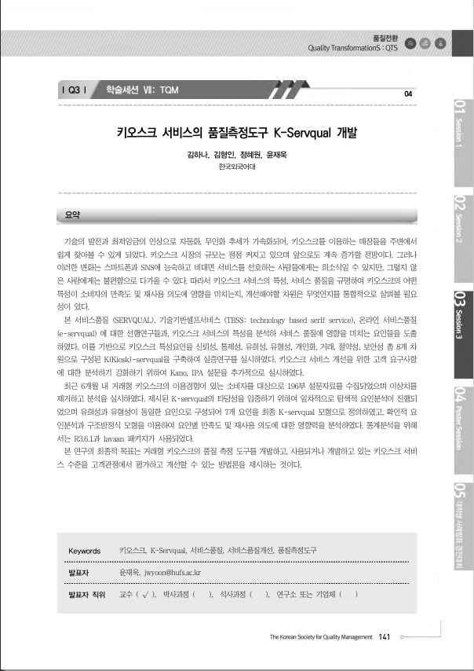
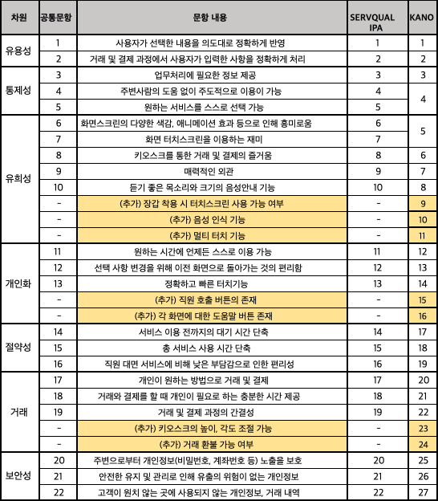

  

<h1 align="center">키오스크 서비스 품질 측정도구 <strong>'K-Servqual'</strong> 개발</h1>

  
## 📍 Quick overview
### 키오스크 시장규모는 계속해서 증가하지만 불편함을 느끼는 고객들을 위한 서비스 품질 개선 필요
#### 연구 방향
> 1) 선행 연구를 바탕으로 K(Kiosk)-Servqual 차원 정의
> 2) 설문기법을 이용해 데이터 수집 (K-Servqual, Kano, IPA 총 세가지 설문기법 사용)
> 3) K-Servqual 차원과 모형의 타당성 검증 (EFA, CFA, Structured Equation Modeling)
> 4) 가설 검증 (확정된 모형을 통해 본 연구를 통해 세워진 가설 검증)

- 자세한 내용은 아래 최종 발표 자료를 참고해주세요

## 💁🏻‍♀️ 2019 한국품질경영학회 추계 학술제 학술세션(TQM)
- 최종 발표 자료 ([link](https://github.com/hanakim120/kiosk-servqual-research/blob/main/%E1%84%92%E1%85%A1%E1%86%A8%E1%84%92%E1%85%AC%E1%84%87%E1%85%A1%E1%86%AF%E1%84%91%E1%85%AD%E1%84%8C%E1%85%A1%E1%84%85%E1%85%AD.pdf))
- K-Servqual 연구 요약 

## 🛠️ Skills
- R 3.6.1 
- SPSS
- Psych, GPArotation package
- Tidyverse, lavvan package

## 🗂️ 연구 배경 및 목적
- 빠른 기술의 변화를 따라가지 못하는 사람들까지도 고려하는 서비스가 제공되기 위해서는 '키오스크'의 특성을 반영한 서비스 품질 측정 척도의 필요성을 느꼈습니다. 

## 📚 이론적 배경 및 선행연구
- 기존 연구되어왔던 대면 서비스/TBSS(기술 기반 셀프서비스)/인터넷 서비스/키오스크 서비스에 대한 특성 요인들을 조사하였습니다.

## ⌨️ 초기모형 및 가설
- 선행연구와 FGI를 통해 키오스크의 특성을 도출하고, 세 차례의 설문지 Pre-testing을 통해 얻은 데이터를  분석하여 k-servqual에 가장 적합하다고 판단되는 8가지 차원을 도출하였습니다.
- 저희 팀은 8가지 차원 중 특히 절약성, 유용성, 통제성이 종합만족도에 영향을 미칠 것이라 예상했습니다. 또한 종합만족도가 재사용 의도에 영향을 미칠 것이라 예상했습니다.

## 📝 설문지 구성
- 설문지는 Google Forms 를 이용하였고, 성별, 키오스크 사용 빈도에 대한 사전 질문, k-servqual 기대와 인지, kano 긍정과 부정, ipa 중요도와 만족도에 대한 질문, 종합만족도와 재사용의도에 대한 사후 질문으로 구성되었습니다.
- 자료수집은 2019년 8월 27일 부터 9월 8일까지 13일간 실시하였고, 최근 6개월 내 거래형 키오스크의 이용경험이 있는 소비자를 대상으로 했습니다. 
- 성별과 사용 빈도에 대한 분포는 표와 같습니다. 

## 📊 연구결과 분석
- 데이터를 분석하기 전 이상치 제거를 위해 3가지 과정을 거쳤습니다.  
- ipa 만족도와 servqual 인지 설문에서 불성실한 답변이라 판단된 데이터를 제거하였고, box plot 분석을 통해 이상치로 판단된 문항수가 전체에서 20% 이상인 응답자를 제외했습니다. 
- 마지막으로 kano 분석에서 모순적 요소가 3개 이상인 응답자를 제거하여 총 194개의 데이터를 분석에 활용하였습니다. 

### 1) Exploratory Factor Analysis
-  서브퀄인지, IPA만족도, 서브퀄(인지-기대)점수 각각에 대해 KMO, Bartlett분석을 한 결과 모두 유의확률을 만족해서 요인분석을 하기에 적합하다고 판단하였습니다. 
-  요인추정방법에서는 두 방법이 비슷하지만, Pa가 unsensitive하기 때문에 Pa를 선택합니다. 
-  마지막으로 서브퀄인지와 IPA만족도를 각각 Promax, Varimax로 분석한 결과, IPA 만족도의 Varimax 6가지 요인이 가장 적합하다고 나왔습니다. 

- 선행연구를 통해 도출된 8개의 차원 중 유희성과 유형성이 합쳐져서 유형성이 되었고, 개인화와 편리성의 일부가 합쳐져 편리성이 되었습니다. 
- 편리성 문항 중 직원 대면 서비스에 비해 낮은 부담감으로 인한 편리성 문항이 있습니다. 
- 이 문항은 노력의 절약에 관한 문항으로 절약성과 묶일 수 있다고 판단하여 이 문항과 절약성이 합쳐져 절약성이 되어 개선된 최종 k-servqual 차원이 정리되었습니다.

### 2) Confirmatory Factor Analysis
- 서브퀄인지와 IPA만족도를 8가지요인과 6가지 요인에 대해 분석하였습니다. 
- 8개 요인 24문항과 6개 요인 20문항을 비교해본 결과 Servqual인지보다 IPA만족도에서, 8개 요인 24문항 보다 6개 요인 20문항 에서 더 적합한 것을 알 수 있습니다. 
- 따라서 원래의 초기 모형보다 개선모형이 더 나은 것을 알 수 있었습니다.
- 6개 차원에 대한 IPA 만족도를 가지고 종속변수 1개와 2개를 포함했을 때를 비교한 결과, 종속변수 2개를 포함했을 때 더 적합함을 알 수 있었습니다.

### 3) Structured Equation Modeling
- 왼쪽에 있는 모형보다 오른쪽에 있는 mediating model이 CFI, RMSEA값이 더 좋은 결과가 나와 이를 선택했습니다.

## 💻  최종 K-Servqual 측정도구
- 분석 결과, coefficient값이 큰  유형성, 절약성, 유용성이 종합만족도에 가장 큰 영향을 미친다는 것을 알 수 있고, 종합만족도도 재사용의도에 영향을 미친다는 것을 알 수 있었습니다.
- 처음 저희 팀이 생각했던 중요한 세가지 절약성, 유용성, 통제성 중 유용성과 절약성이 연구 결과 중요하다고 나왔습니다. 

## 📃 K-Servqual 의 특징
#### 1) K-Servqual은 키오스크 이용자의 입장에서 개발된 품질 평가 척도이다. (거래형 키오스크 평가에 활용 가능)
#### 2) K-Servqual은 키오스크를 대상으로 개발된 척도이므로 적용 범위가 넓다. (각 장소 별 키오스크의 성격을 고려하여 수정 및 보완하면 효과적인 척도가 될 수 있다.)
#### 3) 이전 선행연구는 대면서비스와 TBSS, 인터넷 서비스에 대한 평가기준만 개발되어 왔지만 K-Servqual은 TBSS의 특성과 인터넷 서비스의 대한 선행연구를 바탕으로 여러 평가기준들을 적절히 통합, 다면적인 소비자 평가 요소들을 반영하였다.

## 📚 K-Servqual 의 한계
#### 1) K-Servqual은 변화하는 흐름에 맞춰 업데이트해야 하며, 변화하는 소비자의 요구를 수시로 파악하여야 한다.
#### 2) K-Servqual이 커버하지 못하는 어떤 서비스의 특수성이 있을 수 있다.
#### 3) K-Servqual의 향후 연구방향은 키오스크의 서비스 품질을 개선하기 위한 측정도구를 개발했지만, 이를 이용하여 본질적인 서비스 품질을 개선하지 못했기 때문에 개선 방안을 모색해보고 실제 키오스크에 적용하는 것이 목표이다.또한 Servqual 외에도 Kano와 IPA 설문을 통해 얻은 데이터를 분석해 무엇이 키오스크 서비스에 영향을 더 미치고 중요한지를 심층적으로 파악하는 것이 향후 목표이다.

## References
[1] 두산백과, 키오스크http://www.doopedia.co.kr/search/encyber/new_totalSearch.jsp
[2] 이은민,2016,”4차 산업혁명과 산업구조의 변화”,정보통신방송정책,Vol.28(15),p.1
[3] 신지민, “동네 식당,편의점, 카페까지…사람 대신 기계가 일한다”,2019.06.29,http://www.hani.co.kr/arti/society/society_general/899810.html
[4] 박민해, “터치 몇 번으로 주문을! 키오스크 전성시대”, 포항공대신문, 2019.03.29, http://times.postech.ac.kr/news/articleView.html?idxno=20773
[5] 김용균, “무인화 추세를 앞당기는 키오스크”, 정보통신기술진흥센터, 2017.4.5
[6] 이지운, “[씨줄날줄] 무인(無人)”, 서울신문, 2019.09.19, https://www.seoul.co.kr/news/newsView.php?id=20190919031011&wlog_tag3=naver
[7] 오수연, 언택트 마케팅 바람, 마케팅 52(2), 2018.2, 60-64
[8] 문다애, “[무인화시대 현황과 전망 上] 무인점포, 어디까지 왔나?”, 아시아타임즈, 2018.09.25 http://www.asiatime.co.kr/news/articleView.html?idxno=198916
[9] 박진형, ‘“‘키오스크의 공습 上’경제 생태계가 바뀐다”, 시장경제신문, 2017.07.06 http://www.meconomynews.com/news/articleView.html?idxno=5714
[10] 최종근, “입출금은 기본, 창구 업무까지 ‘척척’..은행권 ‘고기능 자동화기기’ 늘린다, 파이낸셜뉴스, 2019.07.31 http://www.fnnews.com/news/201907311815475318
[11] 이균성, “삼성창원병원, IT 접목 안면인식 시스템 시범도입”, 의학신문, 2019.09.03 http://www.bosa.co.kr/news/articleView.html?idxno=2111715
[12] 설경진, “[특징주]씨아이테크, 23조 키오스크 시장...최저임금 인상에 공급 확대 기대감 ↑”, 이투데이, 2018.07.18 http://www.etoday.co.kr/news/view/1642838
[13] 양희진, 2012, 기술기반셀프서비스 편의성과 영향요인 및 기술기반셀프서비스 품질의 관계
[14] 민병권, 박정용, 2010, 기술기반 셀프서비스 사용자 수용 요인에 관한 연구
[15] 이인숙, 나영아, 윤혜현, 2013, 외식소비자의 지각된 기술기반 셀프서비스 특성이 만족 및 구매의도에 미치는 영향 연구: 온라인 메뉴주문 시스템을 중심으로
[16] 맹범기, 박경수, 오승원, 2017, 기술기반 셀프서비스 사용태도 및 사용의도에 대한 기술준비도, 사용자 특성, 상황적 요인의 조절효과
[17] 신찬호, 이현주, 2012, 항공사의 Self-Service Technology(SST)품질이 고객만족과 행동의도에 미치는 영향 연구
[18] 김인혜, 2010, TBSS의 특성과 개인 특성이 사용의도에 미치는 영향
[19] 김영균, 2009, 고객의 셀프서비스 테크놀로지로의 전환요인에 대한 실증연구
[20] 최병돈, 이준교, 2011, 셀프서비스테크놀로지에서 고객사전준비도가 서비스품질과 고객가치에 미치는 영향: 온라인 쇼핑을 중심으로
[21] 한상린, 박수민, 2009, 기술준비도가 Self-Service Technology의 사용의도에 미치는 영향
[22] 박진형, 2019, 키오스크의 특성이 지각된 가치, 만족 및 행동의도에 미치는 영향: 외식업체 키오스크 이용자를 중심으로
[23] 고위, 2016, 중국에서의 e-SERVQUAL에 근거한 모바일 어플리케이션의 사용의도에 관한 연구
[24] 김승욱, 2006, 고객관계관리(CRM)측면에서 전자정부 e-서비스의 품질평가
[25] 이문규, 2002, E-SERVQUAL - 인터넷 서비스 품질의 소비자 평가 측정 도구
[26] 최민섭, 2005, 인터넷 부동산 서비스 품질척도(Re-SERVQUAL)의 개발 및 상호 인과관계 분석에 관한 연구 - 기술수용모델(TAM)을 중심으로
[27] 최철재, 2006, 농산물 전자상거래 서비스품질에 관한 연구
[28] 주희엽, 2003, 전자정부 e-service의 수용도 및 품질 만족도평가
[29] 유민영, 2014, 지역적 특성을 고려한 키오스크 서비스의 사용성 평가_강남역 미디어폴과 인사동의 키오스크를 중심으로
[30] 최환석, 2009, 셀프서비스 체크인 키오스크 사용의도_기술수용 모델을 중심으로
[31] 김고은, 2017, 외식서비스의 SST(Self-Service Technology)품질이 불평행동과 전환의도에 미치는 영향: 키오스크를 중심으로
[32] 이진명, 2019, 지각된 위험과 소비자 특성이 외식소비자의 기술기반 셀프서비스(TBSS) 지속이용의도에 미치는 영향
[33] John Soltesz, Renee Keller, 2001, Self-service kiosk with biometric verification and/or registration capability
[34] Dabholkar, 1996, Consumer evaluations of new technology-based self-service options: An investigation of alternative models of service quality
[35] Gwo-Guang Lee, 2005, Customer perceptions of e-service quality in online shopping
[36] Zeithaml, Parasuraman & Malhotra., 2000, “A Conceptual Framework for Understanding E-Service Quality: Implication for Future Research and Managerial Practice”, REPORT, No.0-115, Marketing Science Institute, Cambridge, M, pp.16. 
[37] Zeithaml, V., Parasuraman, A. and Mlhotra, A., 2002, Service Quality Delivery Through Web Sites: A Critical Review of Extant Knowledge. Journal of the Academy of Marketing Science
[38] Matthew L. Meuter, Amy L. Ostrom, Robert I. Roundtree, & Mary Jo Bitner, 2000, Self-Service Technologies: Understanding Customer Satisfaction with Technology-Based Service Encounters
[39] Lin, Hsieh, 2011, Assessing the Self-service Technology Encounters: Development and Validation of SSTQUAL Scale

## License

)

- Copyright [Hana Kim](https://github.com/hanakim120).
