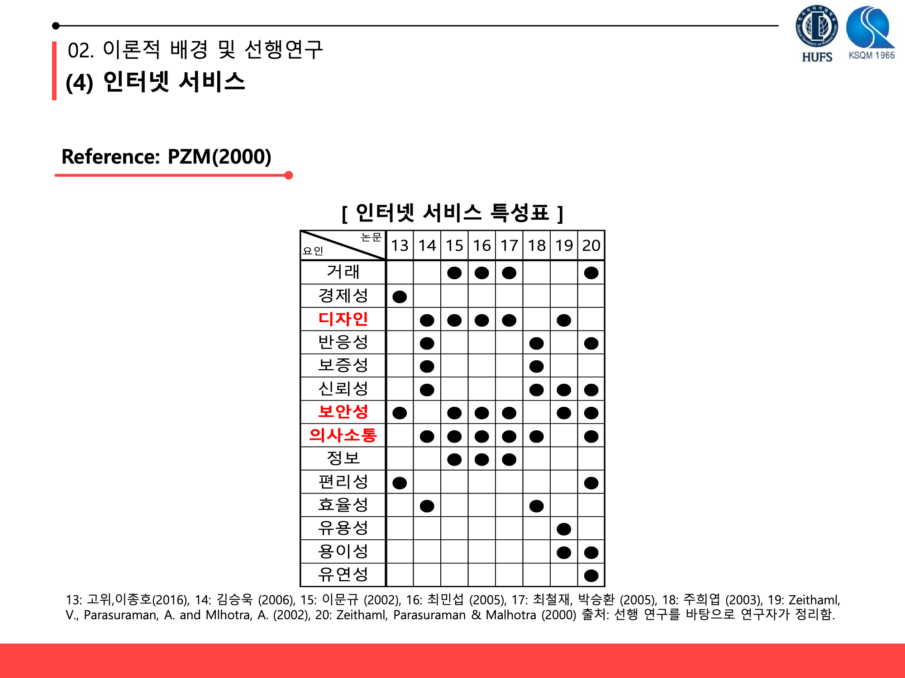

  

<h1 align="center">키오스크 서비스 품질 측정도구 <strong>'K-Servqual'</strong> 개발</h1>

  
## ? Quick overview
### 키오스크 시장규모는 계속해서 증가하지만 불편함을 느끼는 고객들을 위한 서비스 품질 개선 필요
#### 연구 방향
> 1) 선행 연구를 바탕으로 K(Kiosk)-Servqual 차원 정의
> 2) 설문기법을 이용해 데이터 수집 (K-Servqual, Kano, IPA 총 세가지 설문기법 사용)
> 3) K-Servqual 차원과 모형의 타당성 검증 (EFA, CFA, Structured Equation Modeling)
> 4) 가설 검증 (확정된 모형을 통해 본 연구를 통해 세워진 가설 검증)
## ? 2019 한국품질경영학회 추계 학술제 학술세션 (TQM) 발표 자료

- 최종 발표 자료 ([link](https://github.com/hanakim120/kiosk-servqual-research/blob/main/%E1%84%92%E1%85%A1%E1%86%A8%E1%84%92%E1%85%AC%E1%84%87%E1%85%A1%E1%86%AF%E1%84%91%E1%85%AD%E1%84%8C%E1%85%A1%E1%84%85%E1%85%AD.pdf))

## ?? Skills
- R 3.6.1 
- SPSS
- Psych, GPArotation package
- Tidyverse, lavvan package
## ? 연구 배경 및 목적

## ???? 이론적 배경 및 선행연구

## ???? 초기모형 및 가설

## ? 설문지 구성

## ?? 연구결과 분석
> 1) Exploratory Factor Analysis

> 2) Confirmatory Factor Analysis

> 3) Structured Equation Modeling

## ? 최종 K-Servqual 측정도구

## ? K-Servqual 의 특징
> 1) K-Servqual은 키오스크 이용자의 입장에서 개발된 품질 평가 척도이다. (거래형 키오스크 평가에 활용 가능)
> 2) K-Servqual은 키오스크를 대상으로 개발된 척도이므로 적용 범위가 넓다. (각 장소 별 키오스크의 성격을 고려하여 수정 및 보완하면 효과적인 척도가 될 수 있다.)
> 3) 이전 선행연구는 대면서비스와 TBSS, 인터넷 서비스에 대한 평가기준만 개발되어 왔지만 K-Servqual은 TBSS의 특성과 인터넷 서비스의 대한 선행연구를 바탕으로 여러 평가기준들을 적절히 통합, 다면적인 소비자 평가 요소들을 반영하였다.

## License

)

- Copyright ? [Hana Kim](https://github.com/hanakim120).
